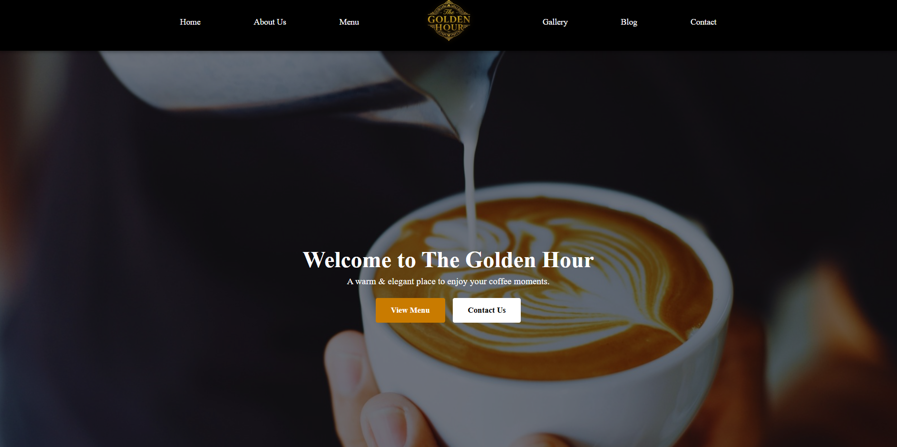

# Golden Hour Café – Custom WordPress Theme

This project is a custom WordPress theme developed for the Golden Hour Café website. The theme was built from scratch to showcase my skills in WordPress development, PHP, and responsive web design. It features a modular architecture and fully responsive layouts.

## Table of contents

- [Overview](#overview)
  - [Screenshot](#screenshot)
  - [Links](#links)
- [My process](#my-process)
  - [Built with](#built-with)
  - [What I learned](#what-i-learned)
- [Author](#author)

## Overview
Golden Hour Café is a fully responsive WordPress theme designed to deliver a clean, modern, and user-friendly experience. The project demonstrates custom theme development, modular PHP templates, and structured HTML/CSS for maintainability and scalability.

Key features include:

• Custom WordPress Theme – Built from scratch with modular PHP templates for headers, footers, and content sections.

• Responsive Design – Mobile-friendly layouts with Bootstrap for tablets, phones, and desktops.

• Menu/Services Section – Organized and visually appealing menu for café offerings.

• Contact & Location – Functional contact forms and embedded Google Maps for directions.

• Blog/News Section – Easily add posts or updates using WordPress CMS.

• Reusable Widgets & Components – Custom PHP widgets for flexible content placement.

• Structured HTML & CSS – Clean, maintainable, and scalable code.

• Cross-Browser Compatibility – Tested to work across major browsers and screen sizes.

### Screenshot

### Links

- Live Site URL: [Golden Hour Café Live Site](https://litwordpress.infinityfreeapp.com/)

## My process
I started by planning the site structure and creating reusable PHP templates for headers, footers, and content sections. Then I:

1. Created a custom WordPress theme folder with modular PHP templates.

2. Built reusable theme components including menus, widgets, and page sections.

3. Implemented responsive layouts using CSS and Bootstrap for mobile-friendly design.

4. Tested cross-browser compatibility and responsiveness across devices.

5. Ensured structured and maintainable HTML/CSS for easy updates.

6. Deployed the theme on InfinityFree for a live preview.

### Built with

- WordPress (Custom Theme Development)

- PHP (Modular Templates & Structured Code)

- HTML5, CSS3, JavaScript (Responsive Layouts & Interactions)

- Bootstrap (Responsive Layouts)

- InfinityFree Hosting

### Growth & Insights 🌱

- Structuring a modular WordPress theme with reusable templates.

- Creating responsive and mobile-friendly layouts.

- Managing dynamic content within WordPress.

- Testing and debugging cross-browser compatibility issues.

- Deploying a fully functional WordPress theme to a live server.

- Managing a production deployment on Vercel

## Author

- Website - [My Portfolio](https://lit-97.github.io/portfolio/)
- GitHub  - [@Lit-97](https://github.com/Lit-97)
